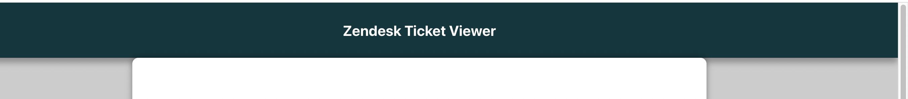
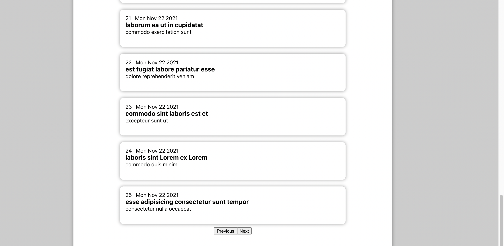
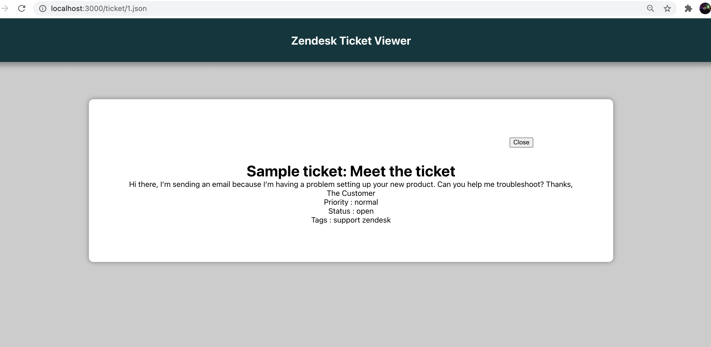

# ZendeskCodingChallenge
## An Express Server (Backend) that uses the Zendesk API to GET paginated (25 tickets at a time) tickets and redirects them to the React frontend.

# Installation
## Step 1 : Setting up the Project
- Clone the repository to your local machine.
- Change the directory to the *backend* directory and use command *npm i* to install all the backend dependencies
- Change the directory to the *frontend* directory and use command *npm i* to install all the frontend dependencies

## Step 2 : Running the Backend
- Move your current directory to the backend directory.
- Run the command  *nodemon server.js* to run the server. (The server runs on PORT 4000).

## Step 3 : Running the Frontend
- Using another terminal, move yor current directory to frontend directory.
- Run the command  *npm start* to run the frontend. (The frontend runs on PORT 3000)

## Step 4 : Accessing the Frontend
-  Go to any browser application and load `http://localhost:3000/` to see the application live in action!

# Tech Stack

## Backend - Node.js + Express
Using a *node* server like express allowed me to keep the backend code clean and efficient. *Express* makes it simple to identify between the various endpoints that the server supports. Furthermore, the node environment allowed me to employ *HTTP* libraries such as *Axios*, which uses the promise mechanism to reduce the requirement for asynchronous functions.

## Frontend - React
The dynamic nature of the coding challenge was one of the main reasons I chose *react.js* as my frontend. I believe that utilizing react is a simple and effective technique to manage data in the frontend because paginated data had to be retrieved and presented on the frontend every time the user clicked on the previous or next buttons. Furthermore, react hooks such as *useState* and *useEffect* can update frontend components if ticket data changes.

# Design of the application
## When the Main Screen loads :
- When the `http://localhost:3000/` is loaded in the browser, the frontend is triggered.
- The frontend makes a *GET* request to the server running on `http://localhost:4000/` by hitting the `/` endpoint of the server.
- The server then makes an API call to the Zendesk endpoint. API responds to the server by sending the data in JSON format. The server then redirects the data to the frontend.
- As soon as the frontend gets the JSON data, it maps this list of tickets to a Ticket Component and renders the screen.

## When the Navigation buttons are clicked : 
- Whenever the user clicks on the next or the prev buttons, the frontend initiates a *GET* request to the server at the */next* endpoint.
- The server in turn initiates a *GET* request for the next 25 tickets that are to be served from the Zendesk API.
- The API responds to the server by sending the data in JSON format.
- The server then redirects the data to the frontend.
- As soon as the frontend gets the JSON data, it maps this list of tickets to a Ticket Component and renders the screen.

## When an individual ticket component is clicked
- Whever the user clicks on an individual ticket, the frontend initiates a *GET* request to the server at the *`/ticket`* endpoint.
- The server in turn initiates a *GET* request for the ticket data that was clicked by the user.
- The *API* responds to the server by sending the data in JSON format.
- The server then redirects the data to the frontend.
- As soon as the frontend gets the JSON data, it maps this data to the Detailed Ticket Component.

# Design Decisions
## For the Main Screen
Just before the frontend is rendered when the user loads the `http://localhost:3000/`, the frontend makes a get request to the server at the '/' endpoint. This implementation was chosen because it prevents asyncronization between the backend and frontend components. As a result, the frontend components will only be loaded when data is accessible for the frontend.

For the main screen, the backend requests only for the first 25 tickets in order to implement pagination.

## Pagination
To effectively implement pagination, the frontend sends a GET request to the appropriate backend URL whenever the Main screen is loaded or the user clicks on the next and previous buttons. In turn, the backend sends a GET request to the Zendesk API to get the next 25 or prior 25 tickets.
After weighing all of my options, I decided on this design. One option is to load all of the tickets at once and then browse through the data in the frontend, but given the dynamic nature of the coding competition use case, I believe this design is not scalable and will not be appropriate.

To cope with the pace and dynamic nature of the data, it is best to perform an API request every time the user clicks on the next or previous buttons or loads the main screen. This is because, rather than showing tickets that have previously been addressed, an API call would offer updated data. Furthermore, because only 25 tickets are requested at a time, this method is much more scalable. The frontend pagination method fails to deliver a satisfactory UX to the user if we load all of the tickets for an account with millions of tickets due to the excessive loading time.

